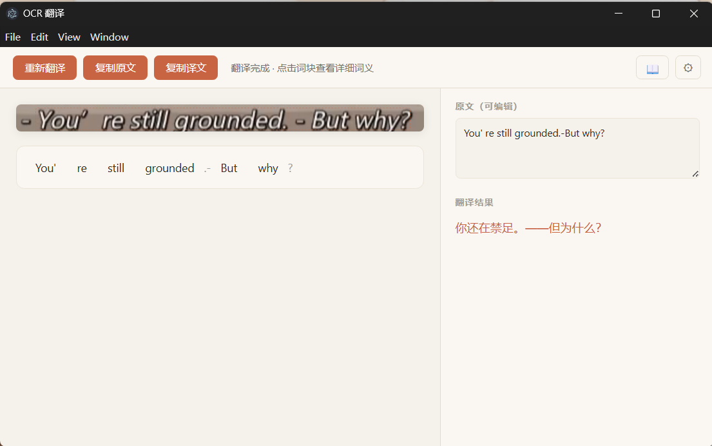
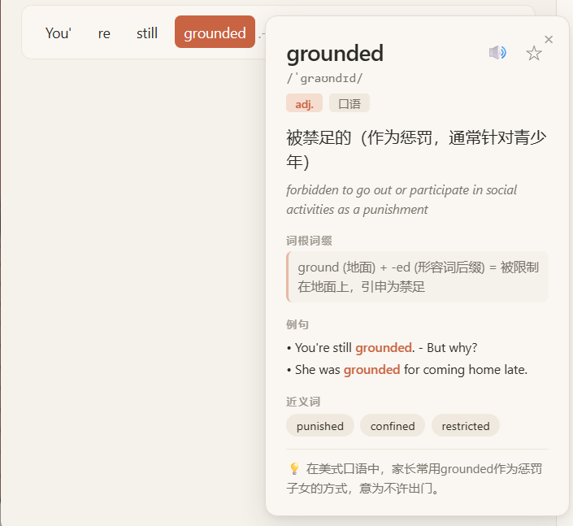
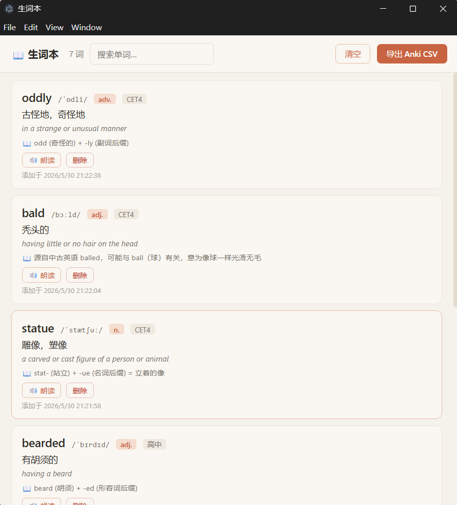

<div align="center">


# Lensy

**框选屏幕 → AI 翻译 → 点词查释义 → 收藏到生词本**

[](LICENSE)
[]()
[](https://github.com/muggeotruslow-afk/lensy/releases)

</div>

---

按一个热键框选屏幕任意文字，立即识别 + 翻译，每个词都能点击查询音标、释义、词根词缀、例句、近义词，一键收藏到生词本，导出 Anki 卡片系统复习。

**适用场景**：看英文视频/动画字幕、读英文 PDF、浏览国外网页、阅读截图英文文档时遇到不认识的单词或想快速翻译整段。



---

## ✨ 特性

| 功能 | 说明 |
|------|------|
| 🎯 **全局热键框选** | `Alt+Shift+T` 唤起，截图冻结后框选，避开视频黑屏问题 |
| 🌐 **AI 翻译** | 接 DeepSeek API（性价比极高，新用户免费额度），自动翻译框选内容 |
| 📖 **逐词查询** | 点任意单词 → 音标、词性、中英文释义、例句、近义词、**词根词缀**、词频标签（CET4/CET6/GRE…） |
| 🔊 **发音** | 浏览器原生 TTS，离线可用 |
| ⭐ **生词本** | 收藏单词，本地 JSON 存储，可一键导出 Anki CSV 系统复习 |
| 📋 **剪贴板翻译模式** | 复制文字后按热键，弹出翻译窗口，无需截图 |
| 🎨 **多 OCR 引擎可切换** | Tesseract.js / Umi-OCR / Windows 系统 OCR |
| 🚀 **Umi 一键管理** | 自动发现 Umi-OCR，一键启动并检测本地服务，可随 Lensy 自动启动 |
| 🪟 **系统托盘常驻** | 关闭主窗口不退出，热键随时唤起 |
| 🛠 **手动修正** | OCR 识别错了？翻译面板顶部直接改原文，点「重新翻译」 |
| 💾 **缓存 + 本地优先** | 同一个单词 1 小时内不重复请求 LLM，离线情况下生词本依然可读 |

 

---

## OCR 引擎评测与默认策略

Lensy 默认使用 **Umi-OCR + DeepSeek**。OCR 负责把字幕从画面中读出来，DeepSeek 负责结合上下文翻译和整理语义；两者分工不同，不能把 LLM 的补全能力当作 OCR 识别能力。

### 对比方法

- 使用同一批 **10 组** 视频 / 美漫字幕截图作为样本；
- 两个方案均接入 DeepSeek，避免把翻译模型差异混入 OCR 对比；
- 重点观察复杂字幕字体下的漏字、错字、断句和“未识别到文本”情况。

| 方案 | 观察结果 | 结论 |
|------|----------|------|
| Windows OCR + DeepSeek | 常规印刷体可用；面对美漫字幕等特殊字体时，容易出现漏字、字符误识别或断句。DeepSeek 能依据残缺文本和上下文补成较通顺的译文。 | 可作为轻量备选，但不适合作为默认引擎。 |
| Umi-OCR + DeepSeek | 在同一批样本中，字幕文字提取更完整、断句更稳定；识别结果交给 DeepSeek 后，翻译更接近原句语义。 | 设为默认方案。 |

### 一个关键边界

DeepSeek 能对 **已有但不完整的 OCR 文本** 做语义修复，例如补足被拆散的句子；但当 Windows OCR 直接返回“未识别到字幕”时，LLM 没有可翻译的输入，无法凭空补回原文。因此，先保证 OCR 的文字提取质量，比单纯依赖后续翻译补救更可靠。

Lensy 仍保留 Windows OCR 和 Tesseract.js 作为可切换引擎，便于针对不同素材、设备和隐私偏好进行取舍。

---

## 🆚 跟有道词典之类的有啥区别

简单粗暴的对比：

| 维度 | 有道 / 搜狗 / 各种取词工具 | Lensy |
|------|---------------------------|-------|
| **词义来源** | 词典数据库（柯林斯/牛津） | LLM 实时生成（带**词根词缀**、**记忆技巧**、**词频标签**） |
| **上下文敏感** | 字面释义 | LLM 看上下文给出**场景化翻译** |
| **可定制** | 几乎不可改 | 全开源，prompt / 翻译风格自调 |
| **OCR 引擎** | 锁定自家云端 | 3 个可切（本地 Tesseract / 本地 Umi-Paddle / 系统 OCR） |
| **隐私** | 文字发服务器 | 你选服务（DeepSeek / 自部署 LLM 都行） |
| **价格** | 免费 + 广告 + 推会员 | 0 元 + DeepSeek 几分钱一次 |
| **生词本** | 多端云同步（绑账号） | 本地 JSON，可 git/备份/导出 Anki |

**定位**：不是有道平替——是给**英语学习者、爱折腾的用户、注重隐私的人**的 AI 驱动版。

> 举个例子：查 `grounded` 在 "I'm grounded" 上下文中，有道会给「在地面上」，Lensy 会识别这是青少年口语，给「被禁足」+ 词根 `ground (地面) + -ed = 被限制在地面上`。

---

## 📦 安装

### 普通用户（推荐）

1. 打开 [Lensy Releases](https://github.com/muggeotruslow-afk/Lensy/releases/latest)。
2. 下载并运行 Windows 安装包，或使用免安装版。
3. 启动后在右下角系统托盘找到 Lensy 橙色图标。

日常使用 Lensy 不需要安装 Node.js、Git，也不需要手动运行 PowerShell。

### 从源码运行（开发者）

### 前置要求

| 软件 | 必需性 |
|------|--------|
| [Node.js](https://nodejs.org) 18+ | ✅ 源码运行必需 |
| [Git](https://git-scm.com) | ✅ 源码运行必需 |
| [Umi-OCR](https://github.com/hiroi-sora/Umi-OCR/releases) | ⭐ 强烈推荐（识别准确度大幅提升） |
| [Anki](https://apps.ankiweb.net) | ⚪ 可选（用 Anki 复习单词） |

### 步骤

```powershell
# 1. 克隆
git clone https://github.com/muggeotruslow-afk/lensy.git
cd lensy

# 2. 国内用户先配镜像（可跳过，但 electron 下载慢）
echo electron_mirror=https://npmmirror.com/mirrors/electron/ > .npmrc

# 3. 安装依赖
npm install

# 4. 如仓库未包含训练数据，再下载 OCR 训练数据（约 23MB）
mkdir assets\tessdata -Force
Invoke-WebRequest "https://github.com/tesseract-ocr/tessdata/raw/main/eng.traineddata" -OutFile "assets\tessdata\eng.traineddata"

# 5. 启动
npm start
```

启动后系统托盘出现 **Lensy 橙色图标**。Windows 11 默认会把新托盘图标藏在「∧」溢出菜单里，建议拖出来固定显示。

---

## ⚙ 首次使用：3 步配置

### 第 1 步：注册 DeepSeek 拿 API Key

1. 打开 [platform.deepseek.com](https://platform.deepseek.com) 注册
2. 进入 **API Keys** → **Create new API key**
3. 复制 `sk-` 开头的字符串保存好（页面关掉看不到第二次）

> **为什么不用免费的？** DeepSeek 充值 10 元够用几个月，比 OpenAI 便宜 95%，中文翻译质量好。新账号有免费额度。

### 第 2 步：在工具里填 API Key

1. 右键系统托盘的 Lensy 图标 → **设置**
2. **DeepSeek API Key** 粘贴你的 key
3. 点 **测试连接**，看到 ✓ 即成功
4. **保存**

### 第 3 步（推荐）：让 Lensy 管理 Umi-OCR

Tesseract 对漫画字幕、艺术字识别一般。Umi-OCR（基于 PaddleOCR）准确度逼近百度云 OCR：

1. 下载 [Umi-OCR Paddle 版](https://github.com/hiroi-sora/Umi-OCR/releases)（约 128MB，选 `Umi-OCR_Paddle_xxx.7z.exe`）
2. 双击自解压到任意目录，不需要把 Umi 单独设为开机启动
3. 回 Lensy：托盘 → **设置** → OCR 引擎选择 **Umi-OCR**
4. Lensy 会自动查找 `Umi-OCR.exe`；没找到时点 **选择程序** 指定一次
5. 点 **一键启动**，看到“Umi-OCR 已启动并连接”即可
6. 保持 **Lensy 启动时自动启动 Umi-OCR** 开启，以后启动 Lensy 时无需手动打开 Umi

Umi-OCR v2 默认开启仅本机 HTTP 服务。若一键启动后仍显示服务未响应，再打开 Umi 全局设置，确认 HTTP 服务地址为 `127.0.0.1:1224`。

---

## 🎹 日常使用

| 操作 | 方式 |
|------|------|
| **框选翻译** | `Alt+Shift+T` → 鼠标拖框选 → 自动 OCR + 翻译 |
| **点词查释义** | 在结果窗口下方的词条上点击 |
| **收藏单词** | 词义弹窗右上角 ☆ |
| **朗读单词** | 词义弹窗的 🔊 |
| **剪贴板翻译** | Ctrl+C 复制文字 → `Alt+Shift+D`（需在设置启用） |
| **取消框选** | `Esc` |
| **打开生词本** | 托盘右键 / 结果窗口右上角 📖 |
| **打开设置** | 托盘右键 / 结果窗口右上角 ⚙ |
| **导出 Anki** | 生词本 → **导出 Anki CSV** → 在 Anki 中「文件 → 导入」 |
| **退出程序** | 托盘右键 → 退出 |

### 源码版开机自启（可选）

```powershell
$startup = [Environment]::GetFolderPath('Startup')
$src = "$PWD\autorun.vbs"
$ws = New-Object -ComObject WScript.Shell
$sc = $ws.CreateShortcut("$startup\Lensy.lnk")
$sc.TargetPath = "wscript.exe"
$sc.Arguments = "`"$src`""
$sc.WorkingDirectory = $PWD
$sc.IconLocation = "$PWD\assets\icon.ico"
$sc.Save()
```

---

## ❓ FAQ

**Q: 按热键没反应？**
- 检查托盘图标是否在（可能被 Windows 11 藏在「∧」里），托盘没图标说明程序没启动 → 双击桌面快捷方式
- 单实例锁机制，如果你按了多次启动，只有第一个生效

**Q: OCR 识别结果很烂怎么办？**
- 切换 OCR 引擎到 Umi-OCR（第 3 步），在设置中点“一键启动”确认服务在线
- 识别错了可以直接在结果窗口顶部的「原文（可编辑）」框里改正，点「重新翻译」

**Q: 翻译/查词不工作？**
- 设置面板填了 DeepSeek API Key 吗？点「测试连接」确认
- 账号余额不足时会失败，去 [platform.deepseek.com](https://platform.deepseek.com) 充值

**Q: 框选时屏幕黑了一下，B 站视频也黑屏？**
- 我们用「冻结截屏」方式避开了这个问题。如果还有黑屏，确认 main.js 顶部有 `app.disableHardwareAcceleration()`

**Q: API Key 安全吗？**
- 存储在本地 `%APPDATA%\Lensy\config.json`；仅在调用 DeepSeek 时作为鉴权信息发送给 DeepSeek
- `.gitignore` 已排除该文件，不会误传到 GitHub
- 所有界面已关闭 Node.js 权限，只能通过 Lensy 的白名单接口访问主进程
- Umi-OCR 地址只允许本机环回地址，OCR 图片不会被配置成发送到远程 Umi 服务

**Q: Anki CSV 怎么导入？**
- 打开 Anki → File → Import → 选 CSV → 字段分隔符选「Comma」→ 编码 UTF-8 → 确认

---

## 🛠 技术栈

- **Electron** + Node.js — 跨平台桌面框架
- **Context Isolation + preload 白名单** — 渲染窗口不直接接触 Node.js、文件系统或进程权限
- **Tesseract.js** / Umi-OCR (PaddleOCR) / Windows.Media.Ocr — 三引擎可切换
- **DeepSeek Chat API**（OpenAI 兼容） — LLM 翻译 + 词义
- **Jimp** — 图像预处理（灰度、二值化、上采样）

---

## 📝 路线图

- [ ] 划词翻译模式（鼠标选中即翻，不用截图）
- [ ] 多显示器适配（鼠标所在屏触发）
- [ ] 自定义翻译 Prompt（专业领域风格）
- [ ] 历史记录持久化 + 时间线
- [ ] electron-builder CI 自动发 exe
- [ ] 自动更新（electron-updater）
- [ ] macOS / Linux 支持
- [ ] 多 LLM 支持（Claude / GPT / 智谱 / 通义）

---

## 🤝 致谢

- [Umi-OCR](https://github.com/hiroi-sora/Umi-OCR) — 神级开源 OCR 工具
- [Tesseract.js](https://github.com/naptha/tesseract.js) — 浏览器/Node OCR
- [DeepSeek](https://www.deepseek.com) — 高性价比中文友好 LLM
- 设计灵感：Claude 的暖色 UI 风格

---

## 📄 License

[MIT](LICENSE)
